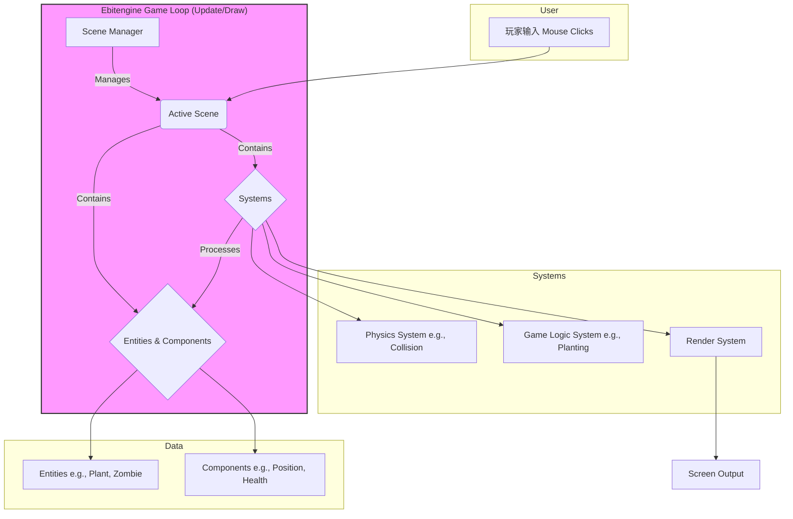
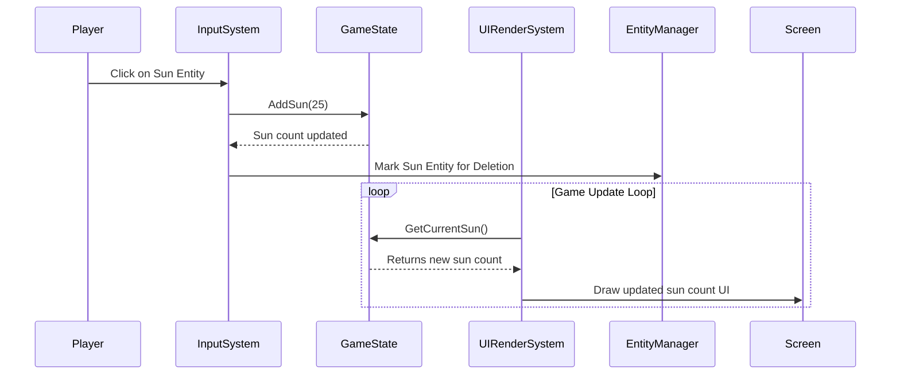
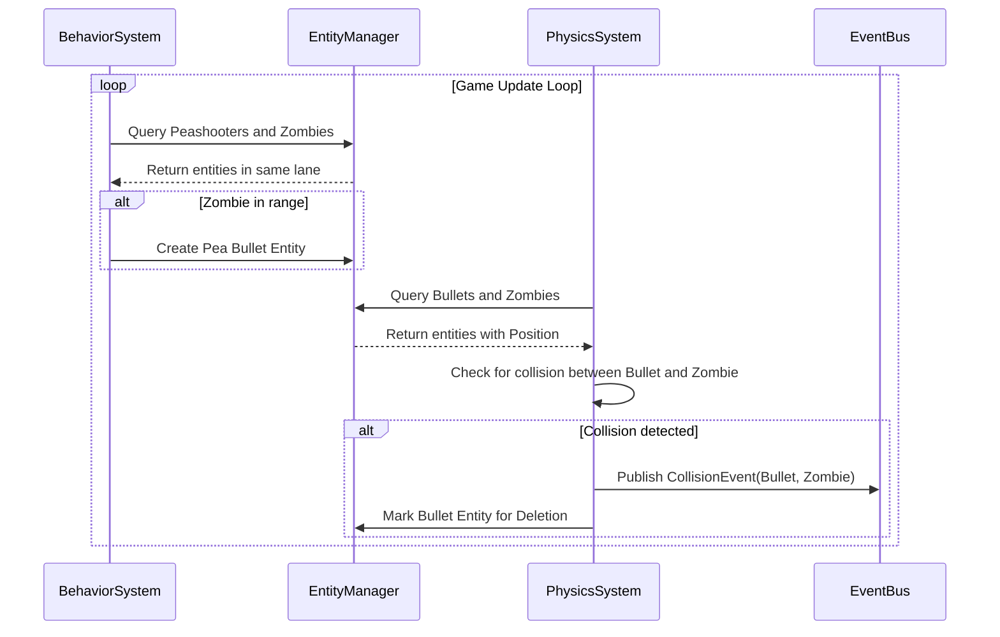
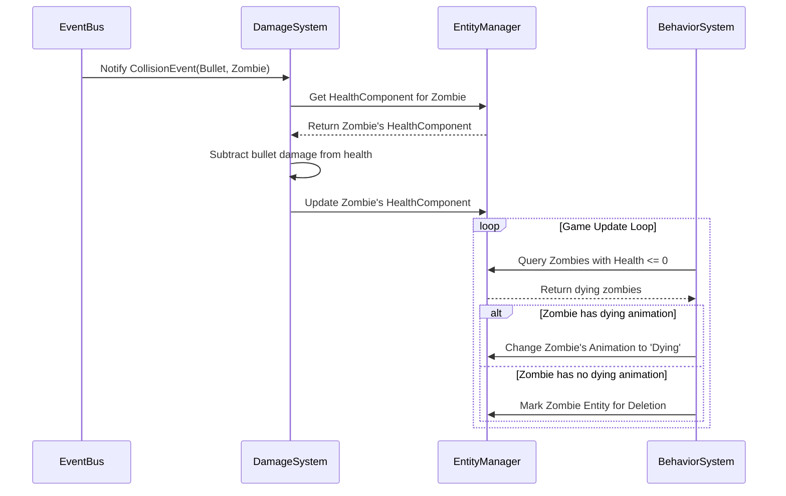

# 植物大战僵尸 AI 复刻版 Architecture Document

## **1. High Level Architecture (高阶架构)**

### **Technical Summary (技术摘要)**
本系统将采用基于**组件化实体 (Component-Based Entity)** 的设计模式，构建一个运行在 **Go + Ebitengine** 技术栈上的单体2D游戏应用。架构的核心是一个**场景驱动的状态机 (Scene-Driven State Machine)**，它负责管理游戏的不同状态（如主菜单、游戏内）。游戏对象（实体）的行为和数据将由可复用的组件（Components）定义，而所有逻辑则由一系列**系统 (Systems)**（如移动系统、渲染系统、碰撞检测系统）来处理。这种设计确保了高度的模块化和可扩展性，完美支持PRD中定义的MVP目标及未来的内容扩展。

### **High Level Overview (高阶概览)**
*   **架构风格:** 采用数据驱动的**实体-组件-系统 (Entity-Component-System, ECS)** 架构模式。这是一种在现代游戏开发中广泛使用的模式，它通过将数据（组件）与行为（系统）分离来提高灵活性和性能。
*   **仓库结构:** 采用**Monorepo**结构，便于未来管理可能出现的共享库或工具。
*   **服务架构:** **Monolith (单体应用)**，所有逻辑打包在单一可执行文件中。
*   **数据流:** 玩家输入（鼠标点击）被事件系统捕获 -> 相应的逻辑系统（如种植系统、收集系统）处理事件 -> 更新组件中的数据 -> 渲染系统根据更新后的组件数据绘制新的一帧到屏幕上。

### **High Level Project Diagram (高阶项目图)**


### **Architectural and Design Patterns (架构与设计模式)**
*   **实体-组件-系统 (ECS):** 核心架构模式。提高代码复用性和灵活性，便于添加新游戏对象。
*   **状态机 (State Machine):** 用于管理全局游戏状态（主菜单、游戏中、暂停等），确保逻辑分离。
*   **对象池 (Object Pooling):** 用于管理频繁创建和销毁的对象（如豌豆子弹），减少内存分配开销，提升性能。
*   **数据驱动设计 (Data-Driven Design):** 游戏对象的属性（生命值、攻击力等）将从外部文件加载，使游戏平衡性调整无需重新编译代码。

## **2. Tech Stack (技术栈)**

为了确保项目的稳定性和可复现性，所有开发都将基于以下明确定义的技术栈。

### **Cloud Infrastructure (云基础设施)**
*   **Provider:** N/A (本地PC应用)
*   **Key Services:** N/A
*   **Deployment Regions:** N/A

### **Technology Stack Table (技术栈详情表)**
| Category | Technology | Version | Purpose | Rationale |
| :--- | :--- | :--- | :--- | :--- |
| **Language** | Go | latest stable | 主要开发语言 | 性能高、编译快、跨平台能力强。 |
| **Game Engine** | Ebitengine | latest stable | 2D游戏渲染与交互 | 纯Go实现，API简洁，跨平台支持良好。 |
| **Data Format** | YAML | v3 | 游戏数据配置 | 相比JSON更易于人类阅读和编写。 |
| **Go YAML Lib**| gopkg.in/yaml.v3 | latest stable | YAML文件解析 | Go社区广泛使用的YAML解析库。 |
| **Build Tool** | Go Modules | N/A | 依赖管理 | Go官方标准的依赖管理工具。 |
| **Testing** | Go Testing Pkg | N/A | 单元/集成测试 | Go标准库内置的测试框架。 |
| **UI Library**| Ebitengine Core API| N/A | UI渲染与交互 | 不引入`ebitenui`。手动管理UI布局能更精确地实现复刻目标。|

## **3. Data Models (数据模型) / Components**

在我们的实体-组件-系统（ECS）架构中，数据模型由各个“组件”的结构体（structs）来定义。实体（如植物、僵尸）是这些组件的集合。以下是实现MVP所需的核心组件定义。

---
### **`PositionComponent`**
*   **Purpose:** 存储一个实体在游戏世界中的二维坐标。所有需要被渲染或参与物理计算的实体都将拥有此组件。
*   **Go Struct:**
    ```go
    type PositionComponent struct {
        X, Y float64
    }
    ```

---
### **`SpriteComponent`**
*   **Purpose:** 存储实体的视觉表现信息，主要是一个指向当前需要绘制的图像的引用。
*   **Go Struct:**
    ```go
    import "github.com/hajimehoshi/ebiten/v2"

    type SpriteComponent struct {
        Image *ebiten.Image
    }
    ```

---
### **`AnimationComponent`**
*   **Purpose:** 管理基于spritesheet的动画。它存储了动画的所有帧、播放速度以及当前状态。
*   **Go Struct:**
    ```go
    import "github.com/hajimehoshi/ebiten/v2"

    type AnimationComponent struct {
        Frames []*ebiten.Image // 动画的所有帧
        FrameSpeed float64      // 帧之间的延迟秒数
        FrameCounter float64
        CurrentFrame int
    }
    ```

---
### **`HealthComponent`**
*   **Purpose:** 存储实体的生命值信息，包括当前生命值和最大生命值。适用于所有可被伤害的单位，如植物和僵尸。
*   **Go Struct:**
    ```go
    type HealthComponent struct {
        CurrentHealth int
        MaxHealth     int
    }
    ```
---
### **`BehaviorComponent`**
*   **Purpose:** 定义实体的行为类型，例如“向日葵”、“豌豆射手”、“普通僵尸”。逻辑系统（Systems）会根据这个组件来决定如何处理一个实体。
*   **Go Struct:**
    ```go
    type BehaviorType int
    const (
        BehaviorSunflower BehaviorType = iota
        BehaviorPeashooter
        BehaviorWallnut
        BehaviorCherryBomb
        BehaviorZombieBasic
        BehaviorZombieConehead
        BehaviorZombieBuckethead
    )

    type BehaviorComponent struct {
        Type BehaviorType
    }
    ```
---
### **`TimerComponent`**
*   **Purpose:** 一个通用的计时器组件，用于处理需要时间延迟的行为，如植物的攻击冷却、向日葵的阳光生产周期等。
*   **Go Struct:**
    ```go
    type TimerComponent struct {
        Name string // 计时器名称，如 "attack_cooldown"
        TargetTime float64 // 目标时间（秒）
        CurrentTime float64
        IsReady bool   // 计时器是否已完成
    }
    ```
---
### **`UIComponent`**
*   **Purpose:** 这是一个标记组件，用于标识一个实体是UI元素。它也可以包含UI相关的状态数据。
*   **Go Struct:**
    ```go
    type UIState int
    const (
        UINormal UIState = iota
        UIHovered
        UIClicked
        UIDisabled
    )
    type UIComponent struct {
        State UIState
        // ... other UI related data
    }
    ```

## **4. Core Systems (核心系统)**

游戏的行为逻辑由一系列专门的“系统”驱动。每个系统在一个游戏循环（Update tick）中运行，查询包含特定组件组合的实体，并对这些组件的数据进行操作。

---
### **`SceneManager` (场景管理器)**
*   **Responsibility:** 管理游戏的宏观状态，如主菜单、游戏场景、暂停菜单等。它负责切换当前活动的场景，并确保只有一个场景的`Update`和`Draw`方法在被调用。
*   **Key Interfaces:** `Update(deltaTime float64)`, `Draw(screen *ebiten.Image)`, `SwitchTo(sceneName string)`。
*   **Dependencies:** 无。它是最高层的控制器。

---
### **`EntityManager` (实体管理器)**
*   **Responsibility:** 负责所有实体（Entities）和组件（Components）的创建、销毁和存储。它是ECS模式的核心数据库。提供查询功能，例如“给我所有同时拥有`PositionComponent`和`SpriteComponent`的实体”。
*   **Key Interfaces:** `NewEntity()`, `AddComponent(entityID, component)`, `GetComponent(entityID, componentType)`, `QueryByComponents(componentTypes ...)`。
*   **Dependencies:** 无。它是游戏世界状态的核心。

---
### **`InputSystem` (输入系统)**
*   **Responsibility:** 捕获并处理所有原始玩家输入（鼠标点击、按键）。它将原始输入转换为游戏内的具体“意图”或“事件”，例如 `SunClickedEvent`, `PlantCardClickedEvent`, `GridCellClickedEvent`。
*   **Key Interfaces:** `Update(deltaTime float64)`。
*   **Dependencies:** `EntityManager` (查询可点击的对象), Event Bus。

---
### **`BehaviorSystem` (行为系统)**
*   **Responsibility:** 这是游戏逻辑的核心。它根据实体的`BehaviorComponent`来执行具体的行为。例如：
    *   **向日葵:** 管理其`TimerComponent`，在计时器结束后创建阳光实体。
    *   **豌豆射手:** 扫描同一行的僵尸，管理攻击`TimerComponent`，在计时器结束后创建子弹实体。
    *   **僵尸:** 控制其移动，检测并啃食植物。
*   **Key Interfaces:** `Update(deltaTime float64)`。
*   **Dependencies:** `EntityManager` (查询并更新实体和组件)。

---
### **`PhysicsSystem` (物理系统)**
*   **Responsibility:** 处理移动和碰撞检测。
    *   **移动:** 根据实体的`VelocityComponent`（如果需要的话）更新其`PositionComponent`。
    *   **碰撞:** 检查所有子弹和所有僵尸的`PositionComponent`和`CollisionComponent`，当发生重叠时，发布`CollisionEvent`事件。
*   **Key Interfaces:** `Update(deltaTime float64)`。
*   **Dependencies:** `EntityManager`。

---
### **`AnimationSystem` (动画系统)**
*   **Responsibility:** 更新所有拥有`AnimationComponent`的实体的动画帧。它会根据`FrameSpeed`和流逝的时间来决定是否切换到下一帧。
*   **Key Interfaces:** `Update(deltaTime float64)`。
*   **Dependencies:** `EntityManager` (查询所有带动画的实体)。

---
### **`RenderSystem` (渲染系统)**
*   **Responsibility:** 迭代所有拥有`PositionComponent`和`SpriteComponent`的实体，并使用Ebitengine的绘图函数将它们绘制到屏幕上的正确位置。这是唯一一个与绘图API直接交互的系统。
*   **Key Interfaces:** `Draw(screen *ebiten.Image)`。
*   **Dependencies:** `EntityManager`。

---
### **`UISystem` (UI系统)**
*   **Responsibility:** 专门处理UI元素的逻辑。查询所有拥有`UIComponent`的实体，根据`GameState`（如阳光数量、冷却时间）更新其状态和`SpriteComponent`。处理UI元素的动画（如按钮点击效果）。
*   **Key Interfaces:** `Update(deltaTime float64)`。
*   **Dependencies:** `EntityManager`, `InputSystem` (接收UI点击事件), `GameState`。

## **5. Core Workflows (核心工作流)**

以下序列图展示了几个关键游戏场景中，不同系统之间的交互流程。

---
### **工作流 1: 玩家收集阳光 (Player Collects a Sun)**
此图展示了从玩家点击阳光到UI更新的完整流程。



---
### **工作流 2: 豌豆射手攻击僵尸 (Peashooter Shoots a Zombie)**
此图展示了豌豆射手自动索敌、发射子弹，以及子弹命中僵尸的全过程。


---
### **工作流 3: 伤害计算与僵尸死亡 (Damage Calculation & Zombie Death)**
此图紧接上一个流程，展示了碰撞事件被处理，最终导致僵尸死亡的流程。



## **6. Source Tree (源代码树)**

项目将采用以下目录结构，以确保清晰的关注点分离（Separation of Concerns），并为未来的扩展提供便利。

```plaintext
pvz/
├── main.go                 # 游戏主入口文件

├── assets/                   # 所有游戏资源
│   ├── images/               # 图片资源 (spritesheets)
│   ├── audio/                # 音频资源 (music, sfx)
│   └── fonts/                # 字体文件

├── data/                     # 外部化的游戏数据
│   ├── levels/               # 关卡配置文件 (e.g., level_1-1.yaml)
│   └── units/                # 单位属性文件 (e.g., plants.yaml, zombies.yaml)

├── pkg/                      # 项目核心代码库
│   ├── components/           # ECS: 所有组件的定义 (e.g., position.go, health.go)
│   │
│   ├── entities/             # ECS: 实体的定义和工厂函数 (e.g., plant_factory.go)
│   │
│   ├── systems/              # ECS: 所有系统的实现 (e.g., render_system.go)
│   │
│   ├── scenes/               # 游戏场景 (e.g., main_menu_scene.go, game_scene.go)
│   │
│   ├── ecs/                  # ECS框架的核心实现 (EntityManager)
│   │
│   ├── game/                 # 游戏的核心管理器 (e.g., scene_manager.go, game_state.go)
│   │
│   ├── utils/                # 通用工具函数 (e.g., timer.go)
│   │
│   └── config/               # 游戏配置加载与管理

├── go.mod                    # Go module文件
└── go.sum

```

## **7. Coding Standards (编码标准)**

所有由AI代理生成的代码都必须严格遵守以下标准，以确保代码库的一致性、可读性和可维护性。

### **Core Standards (核心标准)**
*   **语言与版本:** Go (latest stable)。
*   **格式化:** 所有代码在提交前必须使用 `gofmt` 或 `goimports`进行格式化。
*   **Linting:** 使用 `golangci-lint` 作为代码质量检查工具，并遵循其默认的推荐规则集。
*   **测试文件:** 测试文件必须与源文件在同一个包（package）内，并以 `_test.go` 结尾。

### **Naming Conventions (命名约定)**
| Element | Convention | Example |
| :--- | :--- | :--- |
| **Packages** | `snake_case` | `render_system` |
| **Structs & Interfaces** | `PascalCase` | `PositionComponent` |
| **Methods & Functions** | `PascalCase` (public), `camelCase` (private) | `Update()`, `calculateDamage()` |
| **Variables** | `camelCase` | `currentHealth` |
| **Constants** | `PascalCase` | `DefaultZombieSpeed` |
| **Struct Fields** | `PascalCase` | `X, Y float64` |

### **Critical Rules (关键规则)**
*   **零耦合原则:** **System** 绝不能直接相互调用。所有跨系统的通信必须通过查询`EntityManager`或通过`EventBus`（如果实现）进行。
*   **数据-行为分离:** **Component** 结构体中严禁包含任何方法（行为逻辑）。所有逻辑必须在**System**中实现。
*   **接口优于具体类型:** 在函数和方法签名中，优先接受接口（interfaces）而非具体的结构体类型，以提高代码的灵活性和可测试性。
*   **错误处理:** 严禁忽略（discard）错误。所有可能返回`error`的函数都必须进行检查。使用`fmt.Errorf`或Go 1.13+的`%w`来包装错误以提供上下文。
*   **禁止全局变量:** 除了用于管理全局状态的单例（如`GameState`），严禁使用全局变量。所有依赖都应通过构造函数注入。
*   **注释:** 为所有公共的函数、方法、结构体和接口编写清晰的GoDoc注释。复杂的逻辑块内部需要有行内注释解释其意图。

## **8. Test Strategy and Standards (测试策略与标准)**

### **Testing Philosophy (测试理念)**
*   **方法:** 采用测试驱动开发（TDD）的变体。在实现复杂的游戏逻辑（如伤害计算、单位行为）之前，先编写单元测试来定义和验证其行为。
*   **覆盖率目标:** 对核心逻辑包（如`systems`, `components`）的目标是达到80%以上的单元测试覆盖率。对UI和场景相关的包不作强制要求。
*   **测试金字塔:** 重点投入单元测试（Unit Tests），辅以少量的集成测试（Integration Tests）来验证系统间的交互。暂不考虑端到端测试（E2E Tests）。

### **Test Types and Organization (测试类型与组织)**
*   **单元测试 (Unit Tests):**
    *   **框架:** 使用Go标准库的`testing`包。
    *   **位置:** 测试文件与被测试的源文件位于同一个包下，以`_test.go`结尾。
    *   **范围:** 重点测试独立的、无副作用的函数和算法。
*   **集成测试 (Integration Tests):**
    *   **范围:** 测试多个系统协同工作的场景。
    *   **实现:** 创建一个“测试用”的ECS环境，运行多个系统的Update循环，最后断言实体状态的最终结果。

## **9. Security (安全)**
*   N/A (本地PC游戏)。

