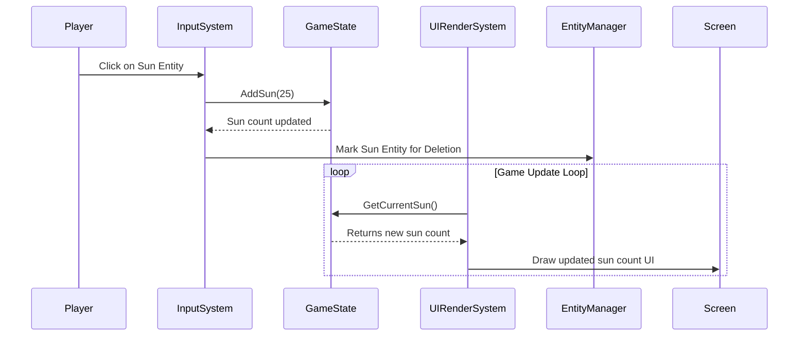
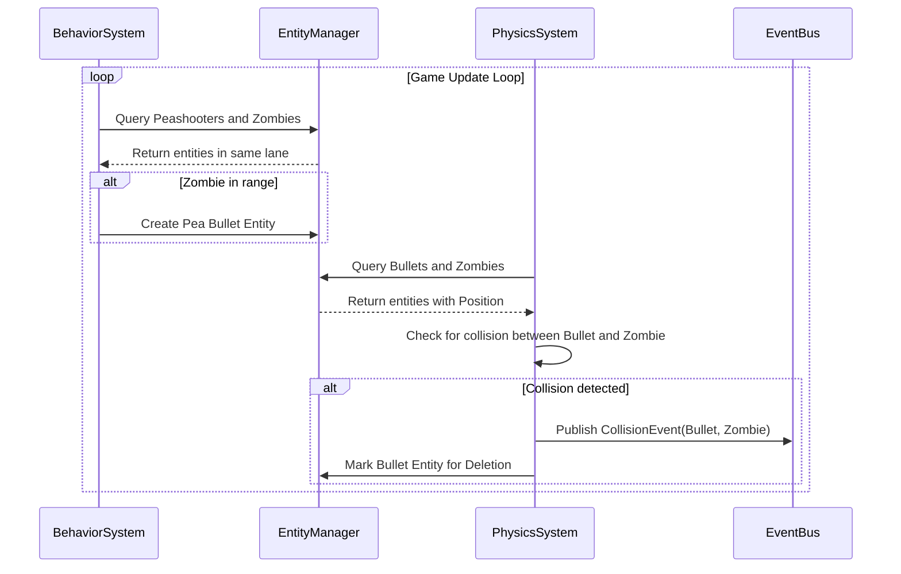
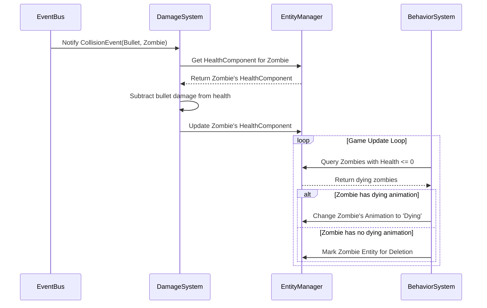

# **5. Core Workflows (核心工作流)**

以下序列图展示了几个关键游戏场景中，不同系统之间的交互流程。

---
## **工作流 1: 玩家收集阳光 (Player Collects a Sun)**
此图展示了从玩家点击阳光到UI更新的完整流程。

---
## **工作流 2: 豌豆射手攻击僵尸 (Peashooter Shoots a Zombie)**
此图展示了豌豆射手自动索敌、发射子弹，以及子弹命中僵尸的全过程。

---
## **工作流 3: 伤害计算与僵尸死亡 (Damage Calculation & Zombie Death)**
此图紧接上一个流程，展示了碰撞事件被处理，最终导致僵尸死亡的流程。

