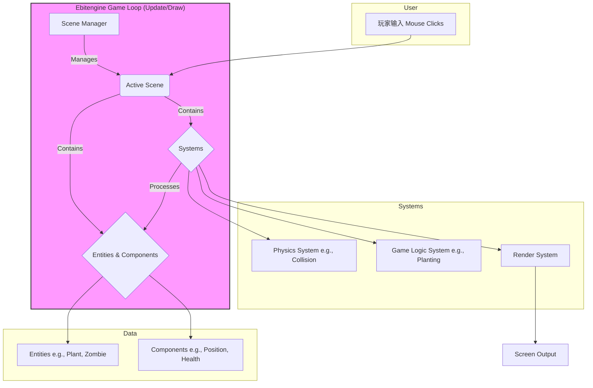

# **1. High Level Architecture (高阶架构)**

## **Technical Summary (技术摘要)**
本系统将采用基于**组件化实体 (Component-Based Entity)** 的设计模式，构建一个运行在 **Go + Ebitengine** 技术栈上的单体2D游戏应用。架构的核心是一个**场景驱动的状态机 (Scene-Driven State Machine)**，它负责管理游戏的不同状态（如主菜单、游戏内）。游戏对象（实体）的行为和数据将由可复用的组件（Components）定义，而所有逻辑则由一系列**系统 (Systems)**（如移动系统、渲染系统、碰撞检测系统）来处理。这种设计确保了高度的模块化和可扩展性，完美支持PRD中定义的MVP目标及未来的内容扩展。

## **High Level Overview (高阶概览)**
*   **架构风格:** 采用数据驱动的**实体-组件-系统 (Entity-Component-System, ECS)** 架构模式。这是一种在现代游戏开发中广泛使用的模式，它通过将数据（组件）与行为（系统）分离来提高灵活性和性能。
*   **仓库结构:** 采用**Monorepo**结构，便于未来管理可能出现的共享库或工具。
*   **服务架构:** **Monolith (单体应用)**，所有逻辑打包在单一可执行文件中。
*   **数据流:** 玩家输入（鼠标点击）被事件系统捕获 -> 相应的逻辑系统（如种植系统、收集系统）处理事件 -> 更新组件中的数据 -> 渲染系统根据更新后的组件数据绘制新的一帧到屏幕上。

## **High Level Project Diagram (高阶项目图)**

## **Architectural and Design Patterns (架构与设计模式)**
*   **实体-组件-系统 (ECS):** 核心架构模式。提高代码复用性和灵活性，便于添加新游戏对象。
*   **状态机 (State Machine):** 用于管理全局游戏状态（主菜单、游戏中、暂停等），确保逻辑分离。
*   **对象池 (Object Pooling):** 用于管理频繁创建和销毁的对象（如豌豆子弹），减少内存分配开销，提升性能。
*   **数据驱动设计 (Data-Driven Design):** 游戏对象的属性（生命值、攻击力等）将从外部文件加载，使游戏平衡性调整无需重新编译代码。
