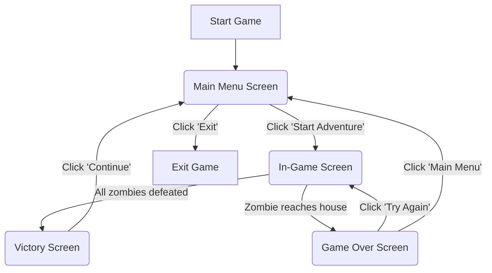
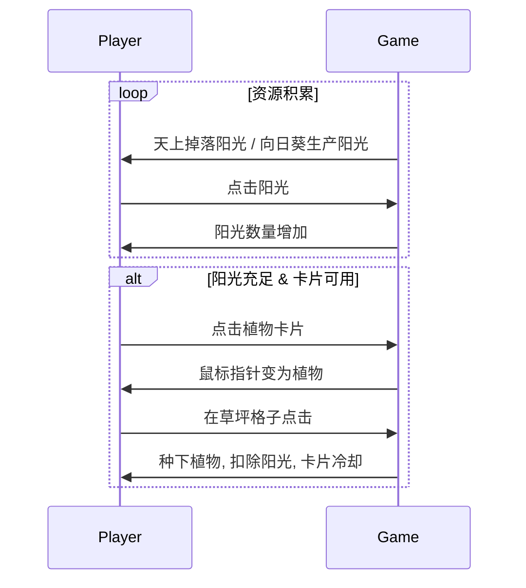
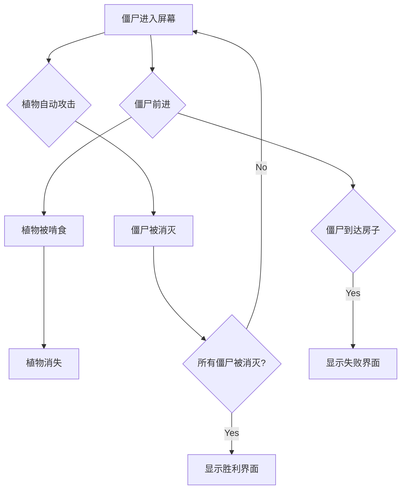

# 植物大战僵尸 Go 复刻版 UI/UX Specification

## **1. Introduction (引言)**
本文件旨在定义《植物大战僵尸AI复刻版》的用户体验（UX）目标、信息架构、用户流程和视觉设计规范。它将作为前端开发（UI实现）的直接指导，确保最终成品在视觉和交互上与原版PC游戏保持高度一致，实现“一比一”的复刻目标。

### **Overall UX Goals & Principles (整体UX目标与原则)**

*   **Target User Personas (目标用户画像):**
    *   **开发者/学习者 (Developer/Learner):** 即我们自己。关注点是技术实现的精确度和对原版逻辑的理解。
    *   **怀旧玩家 (Nostalgic Player):** 任何熟悉并喜爱原版《植物大战僵尸》的玩家。成功的标准是提供与记忆中完全一致的游戏体验。

*   **Usability Goals (可用性目标):**
    *   **零学习成本:** 对于玩过原版的玩家，所有操作应完全符合肌肉记忆。
    *   **信息清晰度:** 阳光数量、卡片冷却、僵尸位置等所有关键信息必须一目了然。
    *   **操作效率:** 玩家可以快速、连续地进行收集阳光、种植植物等高频操作，无任何迟滞感。

*   **Design Principles (设计原则):**
    1.  **忠实复刻高于一切:** 任何设计决策都必须以“原版是不是这样做”为首要判断标准。
    2.  **保留“果冻”质感:** 完美再现原版UI中那种富有弹性、令人愉悦的“果冻般”的点击和动画效果。
    3.  **声画同步:** 所有的交互都必须伴随有对应的、时机精准的音效，这是核心体验的一部分。
    4.  **引导性动画:** 使用动画（如阳光的闪烁、卡片的可用提示）来引导玩家的注意力。

## **2. Information Architecture (IA)**

### **Site Map / Screen Inventory (站点地图 / 屏幕清单)**
游戏的UI由几个核心屏幕（场景）组成，它们之间的关系如下：



### **Navigation Structure (导航结构)**
*   **Primary Navigation (主导航):** 游戏的主要流程是线性的，由玩家在主菜单的“开始冒险”按钮启动，并在游戏结束后通过胜利/失败界面的按钮返回主菜单或重新开始。不存在复杂的、并行的导航结构。
*   **Secondary Navigation (二级导航):** MVP范围暂不涉及二级导航（例如“选项”菜单、“图鉴”等）。
*   **Breadcrumb Strategy (面包屑策略):** 不适用。

## **3. User Flows (用户流程)**

### **Flow 1: 开始游戏并进入关卡 (Start Game & Enter Level)**
*   **User Goal:** 玩家希望从启动游戏到开始玩第一个关卡。
*   **Entry Points:** 启动游戏可执行文件。
*   **Success Criteria:** 玩家成功进入游戏场景，并看到第一波僵尸前的准备阶段。

**Flow Diagram:**
```mermaid
graph TD
    A[启动游戏] --> B{显示主菜单};
    B --> C[点击 "开始冒险"];
    C --> D{加载游戏场景};
    D --> E[显示草坪和UI];
    E --> F[进入 "准备种植" 阶段];
```

---
### **Flow 2: 收集阳光与种植植物 (Collect Sun & Plant)**
*   **User Goal:** 玩家希望积攒资源（阳光）并使用资源在草坪上部署防御（植物）。
*   **Entry Points:** 游戏场景中，有阳光出现或卡片可用时。
*   **Success Criteria:** 玩家成功地在草坪上种植了一株植物，阳光被消耗，卡片进入冷却。

**Flow Diagram:**

**Edge Cases & Error Handling:**
*   **阳光不足:** 点击卡片无反应，或卡片显示为不可用。
*   **冷却中:** 点击卡片无反应。
*   **非法种植位置:** 在已有植物的格子上点击，无反应，种植不成功。

---
### **Flow 3: 自动防御与游戏结束 (Auto-Defense & Game Over)**
*   **User Goal:** 玩家部署的植物能自动抵御来袭的僵尸，并最终决定游戏胜负。
*   **Entry Points:** 游戏场景中，有僵尸进入屏幕。
*   **Success Criteria:** 游戏在一轮完整的攻防后，能正确地判断胜负结果。

**Flow Diagram:**

## **4. Wireframes & Mockups (线框图与模型)**

本部分通过布局描述和简化的线框图，来精确定义核心游戏界面的元素布局，以确保“一比一复刻”的准确性。

---
### **Screen 1: 主菜单 (Main Menu Screen)**
*   **Purpose:** 游戏启动后的入口，提供开始游戏和退出的选项。
*   **Key Elements Layout:**
    *   **背景 (Background):** 全屏显示主菜单的背景图（带墓碑的庭院）。
    *   **Logo:** 《植物大战僵尸》的Logo位于屏幕中央靠上的位置。
    *   **导航按钮 (Navigation Buttons):**
        *   “开始冒险”、“退出游戏”按钮垂直或以一定弧度排列在屏幕右下角区域，与墓碑的视觉元素相结合。
*   **Interaction Notes:** 按钮在鼠标悬停和点击时有明显的视觉反馈（如发光、缩放）。
*   **Visual Reference:** `main_menu_background.png`, `start_button_states.png`。

---
### **Screen 2: 游戏主界面 (In-Game Screen)**
*   **Purpose:** 游戏的核心界面，玩家在此进行所有主要操作。
*   **Key Elements Layout:**
    *   **游戏区域 (Game Area):** 占据屏幕大部分中心区域，为一个5行9列的草坪网格。
    *   **植物选择栏 (Plant Selection Bar):**
        *   **位置:** 屏幕左上角，水平延伸。
    *   **阳光计数器 (Sun Counter):**
        *   **位置:** 紧贴植物选择栏的左侧。
    *   **铲子 (Shovel):**
        *   **位置:** 位于植物选择栏下方。
    *   **关卡进度条 (Progress Bar):**
        *   **位置:** 屏幕右下角。
*   **Interaction Notes:**
    *   所有UI元素都是静态布局。
*   **Visual Reference:** `ingame_background.png`, `ui_bar.png`, `sun_counter.png`, `shovel.png`, `progress_bar.png`。

## **5. Component Library / Design System (组件库 / 设计系统)**

我们将采用“游戏内组件化”的思路，将原版UI中反复出现的元素定义为可复用的组件。

---
### **Component 1: `PlantCard` (植物卡片)**
*   **Purpose:** 在选择栏中代表一种可种植的植物。
*   **States:**
    *   **Available:** 正常显示。
    *   **Unavailable (阳光不足):** 整体变暗。
    *   **Cooling Down (冷却中):** 出现灰色遮罩，表示冷却进度。
    *   **Hover:** 鼠标悬停时有反馈。

---
### **Component 2: `SunCounter` (阳光计数器)**
*   **Purpose:** 显示玩家当前拥有的阳光数量。
*   **States:** 只有一个默认状态，数字会实时变化。

---
### **Component 3: `ShovelButton` (铲子按钮)**
*   **Purpose:** 允许玩家进入“移除植物”模式。
*   **States:**
    *   **Idle:** 正常显示。
    *   **Selected:** 玩家点击后，鼠标指针变为铲子，按钮有激活效果。

---
### **Component 4: `ProgressBar` (进度条)**
*   **Purpose:** 可视化当前关卡的僵尸波次进度。
*   **States:**
    *   **Default:** 从右到左逐渐填充。
    *   **Flag Marker:** 在特定位置有旗帜图标。

## **6. Branding & Style Guide (品牌与风格指南)**

### **Visual Identity (视觉识别)**
*   **Brand Guidelines (品牌指南):** 严格遵循2009年PC版《植物大战僵尸》的视觉风格。

### **Color Palette (调色板)**
*   调色板将直接从游戏的核心素材中提取。

### **Typography (字体)**
*   **Font Families (字体家族):** 使用一种能够最大程度模仿原版游戏中那种卡通、略带不规则感的字体。

### **Iconography (图标)**
*   **Icon Library (图标库):** 所有的游戏内图标必须直接使用已备好的原始素材文件。

### **Spacing & Layout (间距与布局)**
*   **Grid System (网格系统):** 核心布局基于5行9列的草坪网格。
*   **Spacing Scale (间距规范):** 所有间距和布局都必须通过与原版游戏截图进行像素比对来手动调整。

## **7. Animation & Micro-interactions (动画与微交互)**

### **Motion Principles (动态原则)**
*   **弹性与趣味 (Bouncy & Playful):** 所有UI动画的核心原则是体现一种富有弹性、卡通般的“果冻”质感。
*   **夸张的反馈 (Exaggerated Feedback):** 关键操作的反馈应该是夸张和明确的。
*   **无缝衔接 (Seamless Transitions):** 动画应该用于平滑地过渡UI状态的改变。

### **Key Animations (关键动画)**
*   **阳光收集动画:** 阳光被点击后，沿着一条平滑的弧线飞向屏幕左上角的阳光计数器。
*   **植物卡片点击效果:** 卡片被点击时会有一个快速的“被按下”的视觉效果。
*   **植物种植动画:** 植物出现时会有一个“Poof”的烟雾效果。
*   **按钮交互动画:** 按钮会有轻微的缩放、发光或位移。
*   **警告/提示动画:** 提示文字会从屏幕中央放大出现，停留片刻，然后消失。
