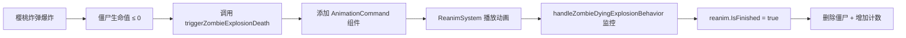

# 重要技术确认：烧焦动画播放机制

## 📋 问题

用户提问：**烧焦死亡动画是否使用 Reanim 模块播放？**

## ✅ 答案：是的！必须使用 Reanim 系统

### 证据

1. **Reanim 文件已存在**：
   - 📁 `data/reanim/Zombie_charred.reanim` ✅ 已确认
   - 这是一个完整的 Reanim 动画定义文件

2. **图片资源是 Reanim 的部件**：
   - `assets/reanim/Zombie_charred*.png` 是 Reanim 的身体部件
   - **不是**独立的帧动画图片序列

3. **当前普通死亡动画的实现**：
   ```go
   // triggerZombieDeath() - 使用 AnimationCommand 组件
   ecs.AddComponent(s.entityManager, entityID, &components.AnimationCommandComponent{
       UnitID:    "zombie",      // 指向 Zombie.reanim
       ComboName: "death",       // 配置驱动的动画组合
       Processed: false,
   })
   ```

---

## 🔧 正确实现方案

### 烧焦死亡动画应该这样播放：

```go
// ✅ 正确：使用 AnimationCommand 组件播放 Reanim 动画
ecs.AddComponent(s.entityManager, zombieID, &components.AnimationCommandComponent{
    UnitID:    "zombie_charred",  // ← 指向 Zombie_charred.reanim
    ComboName: "death",            // 配置驱动的动画组合
    Processed: false,
})

// 设置为不循环
if reanim, ok := ecs.GetComponent[*components.ReanimComponent](s.entityManager, zombieID); ok {
    reanim.IsLooping = false
}
```

### ❌ 错误方案（不要这样做）：

```go
// ❌ 错误：手动设置动画帧（这不是我们的架构）
reanim.CurrentFrame = 0
reanim.CurrentAnim = "Zombie_charred"
// 不要手动加载图片序列
```

---

## 🎯 关键区别

| 死亡类型 | Reanim 文件 | UnitID | ComboName | 头部掉落 | 粒子效果 |
|---------|------------|--------|-----------|---------|---------|
| 普通死亡 | `Zombie.reanim` | `"zombie"` | `"death"` | ✅ 是 | ✅ 是 |
| 烧焦死亡 | `Zombie_charred.reanim` | `"zombie_charred"` | `"death"` | ❌ 否 | ❌ 否 |
| 压扁死亡 | `LawnMoweredZombie.reanim` | `"lawnmower_zombie"` | `"squash"` | ❌ 否 | ✅ 是 |

**注意**：
- 烧焦死亡**不隐藏头部轨道**（整体烧焦，头不掉落）
- 烧焦死亡**不触发粒子效果**（爆炸时已播放过）

---

## 📚 参考实现

### Story 4.4: 普通死亡动画
- 文件：`pkg/systems/behavior/zombie_behavior_handler.go`
- 函数：`triggerZombieDeath()`
- 使用 `AnimationCommand` + `zombie` Reanim

### Story 10.6: 压扁死亡动画
- 文件：`pkg/systems/lawnmower_system.go`
- 使用专用行为类型 `BehaviorZombieSquashing`
- 提供了多死亡类型处理的架构模式

---

## 🛠️ 实施要点

### 1. 资源配置检查

需要确认 `data/reanim_config.yaml` 中是否有 `zombie_charred` 的配置：

```yaml
# 示例（需要验证实际配置）
zombie_charred:
  reanim: "Zombie_charred"
  combos:
    death:
      - anim: "anim_death"
```

### 2. ResourceManager 加载

检查 `pkg/game/resource_manager.go` 是否已加载 `Zombie_charred.reanim`：
- 可能已通过 Reanim 自动扫描加载
- 如未加载，需要手动添加加载逻辑

### 3. 动画播放流程



---

## ✅ Story 5.4.1 已更新

已根据此技术发现更新 Story 文档：

1. **资源说明**：明确说明使用 `Zombie_charred.reanim`
2. **实现策略**：使用 `AnimationCommand` 组件
3. **Task 3-5**：详细的实现步骤和代码示例
4. **参考实现**：指向 `triggerZombieDeath()`

---

## 🎓 总结

**问题**：烧焦动画是用 Reanim 模块的方式吗？

**答案**：**是的！** 必须使用 Reanim 系统，通过 `AnimationCommand` 组件播放 `Zombie_charred.reanim` 动画，而不是手动加载图片序列或手动设置动画帧。

这与当前的普通死亡动画（Story 4.4）和压扁死亡动画（Story 10.6）使用相同的机制，完全符合项目的 ECS 架构和 Reanim 动画系统。
