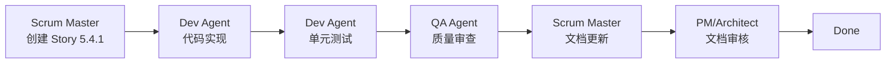

# Sprint Change Proposal: 爆炸死亡烧焦动画实现

## 📋 提案信息

| 属性 | 值 |
|------|-----|
| **提案日期** | 2025-11-26 |
| **提案编号** | SCP-2025-11-26-001 |
| **提案人** | Scrum Master (Bob) |
| **优先级** | 🔴 高优先级 |
| **影响范围** | Epic 5, Epic 7, Epic 8 |
| **预估工作量** | 1 Story Point (4-7 小时) |

---

## 1️⃣ 问题摘要 (Identified Issue Summary)

### 问题定义

**当前状态**：僵尸被爆炸类攻击（樱桃炸弹、土豆雷等）杀死时，播放的是普通死亡动画（头部掉落），与原版游戏不符。

**预期行为**：僵尸被爆炸类攻击杀死时，应该播放专用的烧焦黑化动画（`Zombie_charred*.png`），区分爆炸死亡和普通死亡。

### 触发点

- **触发 Story**: Story 5.4 (樱桃炸弹行为实现)
- **发现时间**: 2025-11-26
- **问题类型**: **新发现的需求** - 原版游戏特性尚未实现

### 问题分类

- [x] 是新发现的需求（原版特性缺失）
- [ ] 是技术限制/死胡同
- [ ] 是对现有需求的根本误解
- [ ] 是基于反馈/新信息的必要调整

### 证据支持

1. **资源已就绪**：
   - ✅ `assets/reanim/Zombie_charred1.png` ~ `Zombie_charred10.png` (10帧烧焦动画)
   - ✅ `assets/reanim/Zombie_charred_head.png` (烧焦头部)
   - ✅ 其他僵尸类型的烧焦资源（路障、铁桶、巨人等）

2. **当前实现**：
   - ✅ Story 5.4 实现樱桃炸弹 3x3 范围爆炸伤害
   - ❌ 所有死亡方式统一使用 `BehaviorZombieDying` 行为类型
   - ❌ 无死亡类型判定机制

3. **原版游戏行为**：
   - ✅ 爆炸死亡有专用烧焦动画
   - ✅ 普通死亡、压扁死亡、爆炸死亡各有不同视觉效果

### 初步影响

| 系统 | 影响程度 | 说明 |
|------|----------|------|
| BehaviorSystem | 🔴 需要修改 | 添加 `handleZombieDyingExplosionBehavior()` |
| Components | 🔴 需要修改 | 添加 `BehaviorZombieDyingExplosion` 常量 |
| ResourceManager | 🟡 需要修改 | 加载烧焦动画资源 |
| 樱桃炸弹逻辑 | 🔴 需要修改 | 爆炸时设置烧焦死亡类型 |
| RenderSystem | 🟢 无影响 | 自动渲染新动画 |
| PhysicsSystem | 🟢 无影响 | 无需修改 |

---

## 2️⃣ Epic 影响摘要 (Epic Impact Summary)

### 当前 Epic 分析

**Epic 5: 游戏流程与高级单位** - ✅ 已完成，需要回顾

| Story | 状态 | 影响 |
|-------|------|------|
| 5.1 - 僵尸啃食与植物生命值 | ✅ Done | 无影响 |
| 5.2 - 坚果墙行为实现 | ✅ Done | 无影响 |
| 5.3 - 高级僵尸行为实现 | ✅ Done | 无影响 |
| 5.4 - 樱桃炸弹行为实现 | ✅ Done | 🔴 **需要补充** |
| 5.5 - 关卡流程管理 | ✅ Done | 无影响 |
| **5.4.1 - 爆炸死亡烧焦动画** | ⬜ **NEW** | 🆕 **新增 Story** |

### 未来 Epic 影响

| Epic | 影响程度 | 说明 |
|------|----------|------|
| Epic 7 - 粒子特效系统 | 🟡 轻微影响 | 未来可能添加烧焦烟雾粒子效果 |
| Epic 8 - 第一章关卡实现 | 🟡 轻微影响 | 改善 1-3 (樱桃炸弹), 1-5 (土豆雷) 关卡视觉体验 |
| Epic 9-16 | 🟢 无影响 | 不涉及僵尸死亡动画逻辑 |

### Epic 结构调整

**推荐行动**：
- ✅ 在 Epic 5 下新增 **Story 5.4.1: 爆炸死亡烧焦动画**
- ✅ 将此 Story 作为 Epic 5 的"遗留缺陷修复"而非新功能开发
- ✅ 不影响 Epic 5 的整体完成状态（作为事后增强）

---

## 3️⃣ 文档调整需求 (Artifact Adjustment Needs)

### PRD 文档

#### ✏️ [需要更新] `docs/prd/requirements.md`

**位置**: FR7.4 (樱桃炸弹)

**当前描述**：
```markdown
FR7.4: **樱桃炸弹** - 种植后短暂延迟即爆炸，消灭周围格子内的所有僵尸。
```

**建议修改为**：
```markdown
FR7.4: **樱桃炸弹** - 种植后短暂延迟即爆炸，消灭周围格子内的所有僵尸。爆炸会触发专用的烧焦死亡动画。
```

---

**位置**: FR9.3 (僵尸死亡)

**当前描述**：
```markdown
FR9.3: 具有独立的生命值，当生命值降为零时会死亡并消失。
```

**建议修改为**：
```markdown
FR9.3: 具有独立的生命值，当生命值降为零时会死亡并消失。死亡动画根据死亡原因不同（普通、爆炸、压扁）。
```

---

#### ✏️ [需要创建] `docs/prd/epic-5-game-flow-advanced-units.md`

> 注意：如果此文件已存在，则需要在 Story 列表中补充

**补充内容**：
```markdown
### Story 5.4.1: 爆炸死亡烧焦动画

**目标**: 实现僵尸被爆炸类攻击杀死时的专用烧焦死亡动画

**验收标准**:
1. 僵尸被樱桃炸弹杀死时播放烧焦动画而非普通死亡动画
2. 僵尸被土豆雷杀死时播放烧焦动画
3. 烧焦动画播放完成后僵尸正确删除
4. 烧焦动画使用正确的资源 (Zombie_charred*.png)
5. 其他死亡方式（豌豆、除草车）不受影响

**依赖**: Story 5.4 (樱桃炸弹行为实现)
```

---

### 架构文档

#### ✏️ [需要更新] `docs/architecture/data-models.md`

**位置**: BehaviorComponent 定义

**补充内容**：
```markdown
### 死亡类型行为

僵尸死亡根据死亡原因有不同的行为类型：

| 行为类型 | 死亡原因 | 动画资源 |
|---------|----------|----------|
| `BehaviorZombieDying` | 普通攻击（豌豆、坚果） | `ZombieDie_*.png` |
| `BehaviorZombieDyingExplosion` | 爆炸攻击（樱桃炸弹、土豆雷） | `Zombie_charred*.png` |
| `BehaviorZombieSquashing` | 除草车碾压 | `LawnMoweredZombie.reanim` |
```

---

### Epic 文档

#### ✏️ [需要创建] `docs/stories/5.4.1.story.md`

完整的 Story 文档（见下文"高层级行动计划"）

---

## 4️⃣ 推荐路径 (Recommended Path Forward)

### 选择的路径：**直接调整/集成** ✅

**理由**：
1. ✅ 工作量最小（1 Story Point, 4-7 小时）
2. ✅ 风险最低（有成熟参考实现 - Story 10.6 压扁动画）
3. ✅ 不影响现有功能，纯增强性质
4. ✅ 符合用户设定的高优先级要求
5. ✅ 提升游戏忠实度（NFR2）

### 拒绝的替代方案

| 方案 | 理由 |
|------|------|
| 回滚 Story 5.4 重做 | ❌ 浪费已完成工作，工作量大，不必要 |
| 调整 MVP 范围降低优先级 | ❌ 与用户高优先级要求冲突，影响忠实度 |
| 暂不处理延后到 Epic 7 | ❌ 与高优先级冲突，用户体验受影响 |

### 技术方案摘要

**参考实现**: Story 10.6 - 除草车碾压压扁动画

**实现模式**：
1. 添加新的死亡行为类型 `BehaviorZombieDyingExplosion`
2. 爆炸攻击触发时设置此行为类型
3. BehaviorSystem 识别并处理烧焦死亡行为
4. 播放烧焦动画，动画结束后删除僵尸

**架构一致性**：
- ✅ 完全符合 ECS 零耦合原则
- ✅ 遵循现有死亡处理模式
- ✅ 通过组件通信，无系统间直接调用

---

## 5️⃣ PRD MVP 影响 (PRD MVP Impact)

### MVP 范围变更

**无变更** - 本提案不调整 MVP 范围

### MVP 目标影响

| MVP 目标 | 影响 |
|---------|------|
| 核心玩法完整性 | 🟢 **改善** - 提升游戏忠实度 |
| 视觉体验 | 🟢 **改善** - 增强死亡动画多样性 |
| 性能目标 | 🟢 无影响 - 烧焦动画与普通死亡动画性能相同 |
| 平台兼容性 | 🟢 无影响 |

### NFR 影响

| NFR | 当前状态 | 修复后状态 |
|-----|---------|-----------|
| NFR2 (忠实度) | ⚠️ 部分符合 | ✅ **完全符合** |
| NFR1 (性能) | ✅ 符合 | ✅ 符合 |
| NFR4 (可扩展性) | ✅ 符合 | ✅ **增强** (死亡类型系统) |

---

## 6️⃣ 高层级行动计划 (High-Level Action Plan)

### 实施步骤

#### Phase 1: Story 创建与规划 (1 小时)

- [ ] 创建 Story 5.4.1 文档
- [ ] 定义验收标准
- [ ] 估算 Story Points (推荐：1 SP)
- [ ] 识别技术任务

#### Phase 2: 代码实现 (2-4 小时)

**Task 2.1: 添加烧焦死亡行为类型**
- [ ] 修改 `pkg/components/behavior.go`
- [ ] 添加 `BehaviorZombieDyingExplosion` 常量
- [ ] 添加 GoDoc 注释

**Task 2.2: 加载烧焦动画资源**
- [ ] 检查 `pkg/game/resource_manager.go`
- [ ] 确认烧焦动画资源加载逻辑
- [ ] 如未加载，添加加载代码

**Task 2.3: 修改爆炸攻击逻辑**
- [ ] 修改 `pkg/systems/behavior_system.go:triggerCherryBombExplosion()`
- [ ] 僵尸死亡时设置 `BehaviorZombieDyingExplosion` 而非 `BehaviorZombieDying`
- [ ] 未来添加土豆雷时使用相同机制

**Task 2.4: 实现烧焦死亡行为处理**
- [ ] 实现 `handleZombieDyingExplosionBehavior()` 方法
- [ ] 播放烧焦动画（Zombie_charred*.png，10帧）
- [ ] 动画结束后删除僵尸实体
- [ ] 增加僵尸消灭计数

#### Phase 3: 测试验证 (1-2 小时)

**Task 3.1: 单元测试**
- [ ] 添加 `TestBehaviorZombieDyingExplosion()` 测试
- [ ] 验证行为类型正确设置
- [ ] 验证动画播放逻辑

**Task 3.2: 游戏内测试**
- [ ] 种植樱桃炸弹，验证爆炸死亡动画
- [ ] 验证普通死亡（豌豆）不受影响
- [ ] 验证压扁死亡（除草车）不受影响
- [ ] 性能测试（多僵尸爆炸场景）

#### Phase 4: 文档更新 (1 小时)

- [ ] 更新 PRD (requirements.md, epic-5*.md)
- [ ] 更新架构文档 (data-models.md)
- [ ] 创建 Story 5.4.1 完成记录
- [ ] 更新本变更提案状态为"已实施"

### 关键里程碑

| 里程碑 | 预计完成时间 | 成功标准 |
|--------|-------------|----------|
| Story 文档创建 | Day 1, 1h | Story 5.4.1.md 创建完成 |
| 代码实现完成 | Day 1, 4h | 所有代码任务完成，编译通过 |
| 测试通过 | Day 1, 6h | 单元测试和游戏内测试全部通过 |
| 文档更新完成 | Day 1, 7h | 所有文档更新完成 |

### 风险与缓解

| 风险 | 概率 | 影响 | 缓解措施 |
|------|------|------|----------|
| 烧焦动画资源格式不兼容 | 低 | 中 | 参考除草车压扁动画实现，已验证资源可用 |
| 爆炸攻击点遗漏 | 中 | 低 | 代码审查，确保所有爆炸攻击使用新机制 |
| 性能影响 | 低 | 低 | 与普通死亡动画性能相同，无额外开销 |

---

## 7️⃣ Agent 交接计划 (Agent Handoff Plan)

### 实施责任分配

| 角色 | 职责 | 交接内容 |
|------|------|----------|
| **Scrum Master (Bob)** | Story 创建、规划 | Story 5.4.1 文档、本变更提案 |
| **Dev Agent (James)** | 代码实现、单元测试 | 实现所有技术任务，确保代码质量 |
| **QA Agent (Quinn)** | 质量保证、测试 | 执行测试计划，代码审查 |
| **PM Agent (Alice)** | PRD 更新审核 | 审核 PRD 文档变更 |
| **Architect (Jordan)** | 架构文档更新 | 审核架构文档变更 |

### 交接顺序



### 下一步行动

1. **立即行动** (Scrum Master):
   - 获取用户对本提案的明确批准
   - 创建 Story 5.4.1 文档
   - 将 Story 加入 Sprint Backlog

2. **后续行动** (Dev Agent):
   - 接收 Story 5.4.1
   - 按照行动计划执行实施
   - 提交代码审查

3. **验收行动** (QA Agent):
   - 执行测试计划
   - 验证所有验收标准
   - 批准或拒绝 Story

---

## 📊 变更提案总结

### 关键决策

| 维度 | 决策 |
|------|------|
| **问题性质** | 新发现的需求（原版特性缺失） |
| **影响范围** | Epic 5 需补充 Story 5.4.1 |
| **实施路径** | 直接调整/集成（工作量 1 SP） |
| **优先级** | 🔴 高优先级 |
| **风险等级** | 🟢 低风险 |

### 成功标准

本变更提案成功实施后应达到：

1. ✅ 僵尸被爆炸类攻击杀死时播放烧焦动画
2. ✅ 普通死亡、压扁死亡不受影响
3. ✅ 所有测试通过
4. ✅ 提升游戏忠实度（NFR2）
5. ✅ 文档更新完成

### 批准请求

**用户批准记录** - ✅ **已批准** (2025-11-26 09:30)

- [x] 同意本变更提案的问题定义和影响分析
- [x] 同意推荐的实施路径（直接调整/集成）
- [x] 同意创建 Story 5.4.1 并加入 Sprint Backlog
- [x] 同意更新 PRD 和架构文档

**批准人**: 用户  
**批准时间**: 2025-11-26 09:30:57  
**批准方式**: 口头确认

---

## 📝 变更历史

| 日期 | 版本 | 变更描述 | 作者 |
|------|------|----------|------|
| 2025-11-26 | 1.0 | 初始创建 | Scrum Master (Bob) |
| 2025-11-26 | 1.1 | 用户批准，状态更新为"已批准" | Scrum Master (Bob) |
| 2025-11-26 | 1.2 | 实施完成，重构 ReanimSystem 支持运行时单位切换 | Dev Agent (James) |

---

**提案状态**: ✅ **已实施完成**
